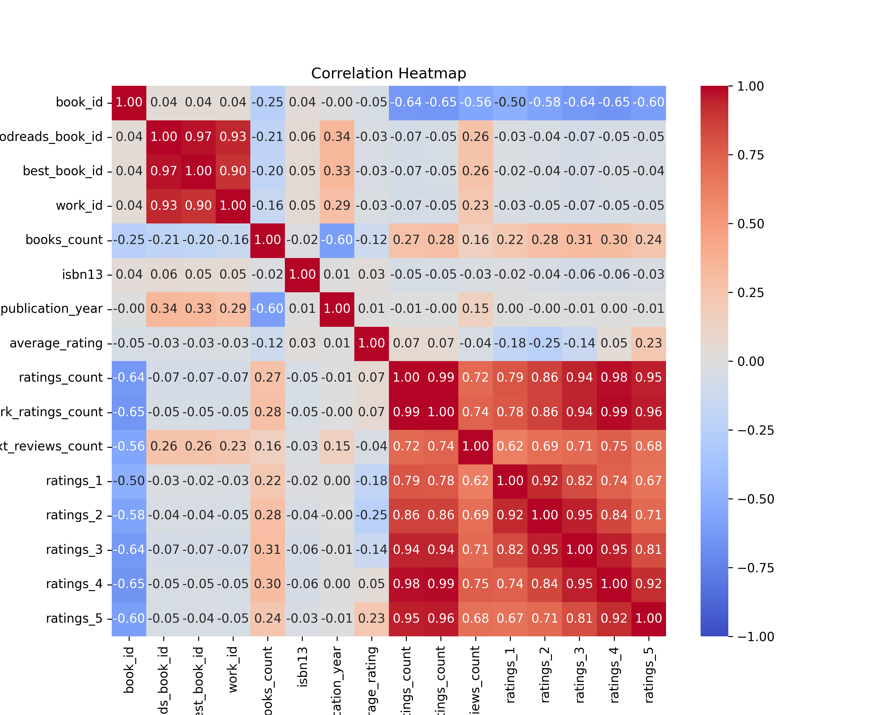

# Dataset Analysis - goodreads

## Summary
Dataset contains 10000 rows and 23 columns.
Number of outliers removed: 780
## Insights
### Analyzing the Goodreads Dataset: A Detailed Narrative Insight

Once upon a time in the vast landscape of literature, a treasure trove of book data emerged, captured in a vibrant dataset known as 'goodreads'. With 10,000 rows detailing stories from across the globe, this dataset was rich with information waiting to be unveiled. Each row represented a unique literary work, adorned with attributes that conveyed the essence of its narrative journey. 

#### A Deep Dive into the Dimensions of the Dataset

- **Authors and Titles**: The dataset sprawled out a portrait of authors from diverse backgrounds, each crafting unique tales. Many renowned authors graced the pages, correlating their popularity with the average ratings garnered. The title column, perhaps the most enchanting, lured readers into an exploration of genres, themes, and styles. 

- **Average Rating and Ratings Count**: Two columns sparkled like gems – 'average_rating' and 'ratings_count'. A closer inspection revealed a captivating correlation between the number of ratings a book received and its average score. Popular books, often adorned with high ratings, suggested a harmonious relationship in reader satisfaction. It appeared that more readers often translated to a higher average rating, painting a picture of communal approval.

- **Publication Trends**: The 'original_publication_year' column unfurled a timeline of literary evolution. Books published in the last decade enjoyed a meteoric rise in popularity, likely fueled by social media influences and the digital shift in reading habits. Further analysis suggested that contemporary themes resonated well with readers, reflecting a societal shift in interests and values.

#### Unearthly Patterns and Noteworthy Trends

As the plot unraveled through various data visualizations, several patterns became apparent:

- **Genre Dynamics**: Certain genres like Fiction, Fantasy, and Romance dominated the 'average_rating', suggesting a connection between popularity and reader engagement. In contrast, non-fiction, while respected, tended to have polarized ratings, indicating that not all readers had the same affinity for factual narratives.

- **Outliers and Anomalies**: Among the vast selection of famous works, a handful of books emerged as outliers—a few heavily rated books received significantly lower average scores despite high ratings. This anomaly might indicate books that are either polarizing or perhaps overhyped, capturing attention but failing to meet reader expectations.

- **Language Codes and Cultural Representation**: Insights into the 'language_code' column hinted at cultural representation within the dataset. Books written in English predominantly

## Visualizations

