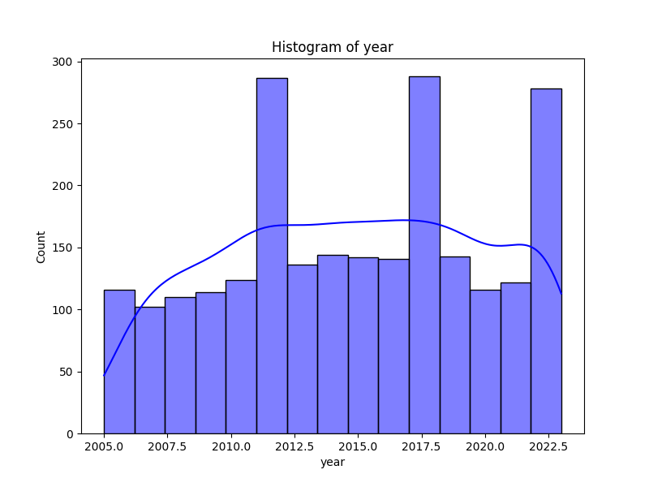
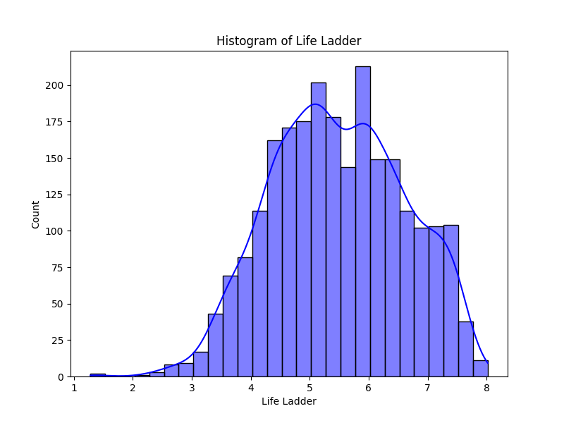
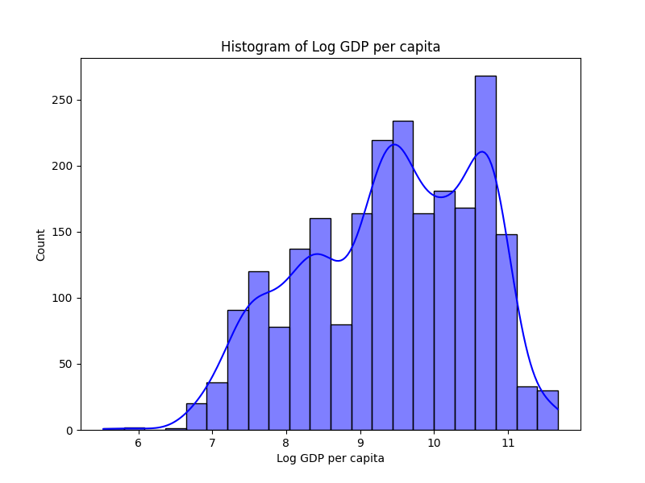
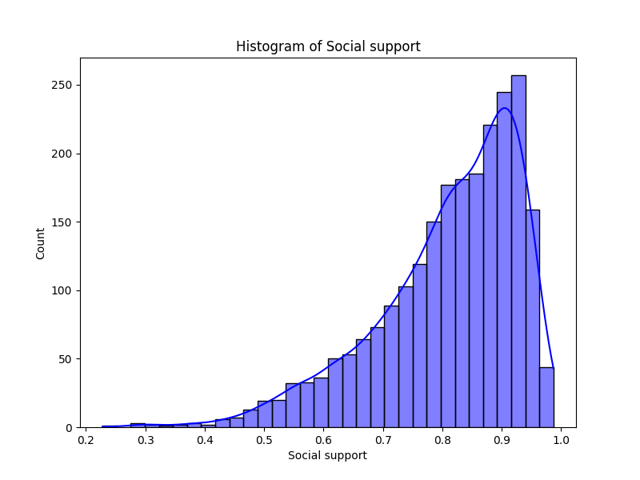
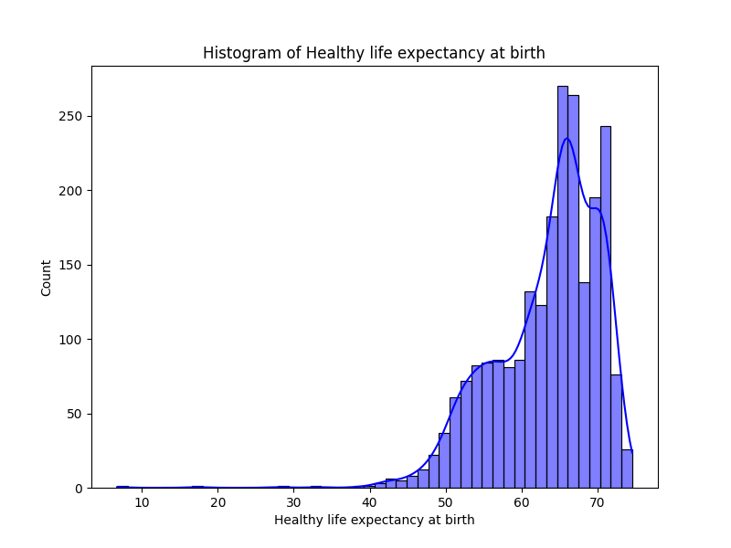
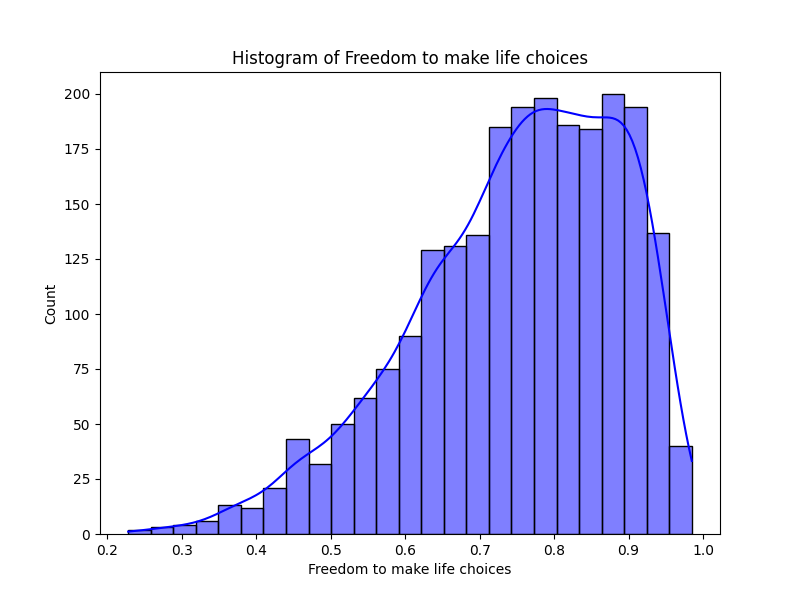
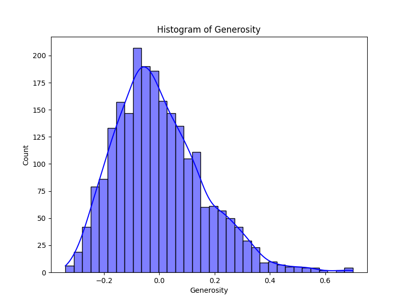
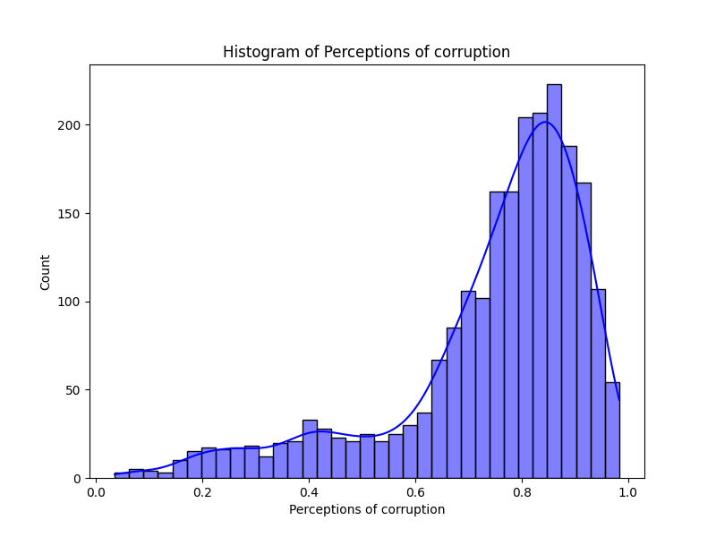
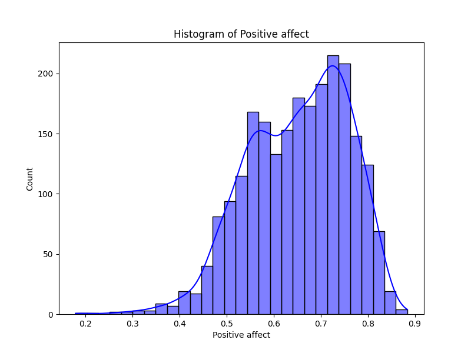
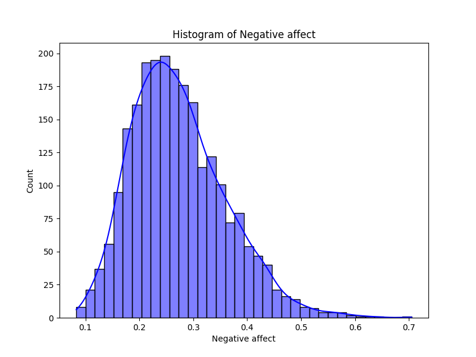

# Automated Data Analysis Report for Happiness

## Dataset: happiness.csv

### Dataset Overview
- **Columns**: ['Country name', 'year', 'Life Ladder', 'Log GDP per capita', 'Social support', 'Healthy life expectancy at birth', 'Freedom to make life choices', 'Generosity', 'Perceptions of corruption', 'Positive affect', 'Negative affect']
- **Missing Values**: {'Country name': 0, 'year': 0, 'Life Ladder': 0, 'Log GDP per capita': 28, 'Social support': 13, 'Healthy life expectancy at birth': 63, 'Freedom to make life choices': 36, 'Generosity': 81, 'Perceptions of corruption': 125, 'Positive affect': 24, 'Negative affect': 16}

### Key Insights
1. **Data Completeness**: The dataset shows varying degrees of missing values across different features, with 'Generosity' having the most missing entries (81) while 'Country name' and 'year' are complete.
2. **Trend Over Time**: The average year in the dataset is around 2014, with a noticeable distribution of data points across the years, indicating potential trends in life satisfaction and other metrics over time.
3. **Indicators of Happiness**: The 'Life Ladder' and 'Log GDP per capita' exhibit a positive correlation with various measures of support and freedom, suggesting that economic stability and social metrics play a significant role in overall life satisfaction.

### Dataset Overview
- **Total Records**: 2363 
- **Unique Countries**: 165 
- **Key Features**: Life satisfaction metrics (Life Ladder), economic indicators (Log GDP per capita), social factors (Social support, Freedom to make life choices), and psychological affects (Positive and Negative affect).
- **Missing Values**: Total of 440 missing entries distributed across various columns; 'Perceptions of corruption' has the highest deficiency.

### Key Findings
1. **Outlier Presence**: 
    - Outliers detected in several columns, notably in 'Social support' (48 rows) and 'Perceptions of corruption' (194 rows), which could influence the analysis if not addressed.
2. **Feature Importance**: 
   - Key determinants of the 'Life Ladder' were identified as 'Social support' (27.2% importance), followed by 'Healthy life expectancy at birth' (10.8%) and 'Log GDP per capita' (10.5%). This indicates the vital role social and health metrics play in influencing happiness scores.
3. **Clustering Results**: Three clusters formed from K-Means clustering suggest distinct groups of countries based on the selected socio-economic and emotional variables, with potential implications for targeted interventions or further analysis.

### Recommendations
1. **Handling Missing Values**: It is recommended to employ imputation methods for missing values, especially for important columns such as 'Log GDP per capita' and 'Generosity,' which can significantly impact analysis outcomes.
2. **Addressing Outliers**: Further investigation and potential removal or adjustment of outliers in critical metrics should be considered to enhance the robustness of analysis.
3. **Expanding Analysis**: Diving deeper into the relationship between identified features and 'Life Ladder' through regression analysis could provide clearer insights into predictive factors of happiness.
4. **Monitoring Over Time**: Regular updates to this dataset with newer entries would facilitate the tracking of trends and shifts in life satisfaction and associated indicators across countries.

### Conclusions
The dataset provides valuable insights into the determinants of happiness across various countries, revealing significant correlations between economic stability, social support, and overall life satisfaction. Despite some missing values and outliers, the feature importance analysis provides a strong foundation for understanding the key contributors to well-being. Moving forward, addressing the issues of data integrity and expanding analytical approaches will enhance the ability to derive actionable insights from this dataset.

### Outlier Detection Results
Detected outliers in 'year': 0 rows
Detected outliers in 'Life Ladder': 2 rows
Detected outliers in 'Log GDP per capita': 1 rows
Detected outliers in 'Social support': 48 rows
Detected outliers in 'Healthy life expectancy at birth': 20 rows
Detected outliers in 'Freedom to make life choices': 16 rows
Detected outliers in 'Generosity': 39 rows
Detected outliers in 'Perceptions of corruption': 194 rows
Detected outliers in 'Positive affect': 9 rows
Detected outliers in 'Negative affect': 31 rows

### Feature Importance Analysis
|    | Feature                          |   Importance |
|---:|:---------------------------------|-------------:|
|  3 | Social support                   |    0.27151   |
|  4 | Healthy life expectancy at birth |    0.107936  |
|  2 | Log GDP per capita               |    0.105402  |
|  0 | year                             |    0.104132  |
|  8 | Positive affect                  |    0.103446  |
|  7 | Perceptions of corruption        |    0.0899058 |
|  5 | Freedom to make life choices     |    0.074778  |
|  1 | Life Ladder                      |    0.0742228 |
|  6 | Generosity                       |    0.0686676 |

### Correlation Analysis
Correlation Matrix saved as C:\Users\acer\Desktop\proj2\happiness\correlation_matrix.png

### Clustering Analysis
K-Means clustering successfully performed with 3 clusters on numeric columns: ['year', 'Life Ladder', 'Log GDP per capita', 'Social support', 'Healthy life expectancy at birth', 'Freedom to make life choices', 'Generosity', 'Perceptions of corruption', 'Positive affect', 'Negative affect']. Results plotted in two dimensions.

### Distribution Analysis
Boxplot created for year.
Boxplot created for Life Ladder.
Boxplot created for Log GDP per capita.
Boxplot created for Social support.
Boxplot created for Healthy life expectancy at birth.
Boxplot created for Freedom to make life choices.
Boxplot created for Generosity.
Boxplot created for Perceptions of corruption.
Boxplot created for Positive affect.
Boxplot created for Negative affect.

### Visualizations

### Suggestions
The dataset you provided contains a variety of metrics related to well-being, economic status, and social factors across different countries over time. Given the richness of the data, there are several analyses that can yield meaningful insights:

### 1. **Trend Analysis Over Time**
   - **Life Ladder Trends:** Analyze how the average Life Ladder score has changed over the years globally and by individual countries. This could help identify periods of improvement or decline in well-being.
   - **Comparative Trends:** Compare trends of key indicators such as Life Ladder, Log GDP per capita, and Healthy life expectancy across countries. Identify patterns, commonalities, or significant differences.

### 2. **Correlation Analysis**
   - **Correlation Between Variables:** Compute the correlation between Life Ladder scores and other variables like Log GDP per capita, Social support, and Healthy life expectancy to identify which factors most influence well-being.
   - **Negative and Positive Affect Correlation:** Analyze how Positive and Negative affect correlate with other constructs. For instance, do higher levels of social support correlate with lower negative affects?

### 3. **Country Comparison**
   - **Country Rankings:** Rank countries based on various metrics (such as Life Ladder, Healthy Life Expectancy), and analyze which countries rank consistently high or low across indicators.
   - **High vs. Low Performers:** Identify characteristics (metrics) of countries with high Life Ladder scores versus those with low scores. 

### 4. **Missing Value Analysis**
   - **Impact of Missing Values:** Investigate the impact of missing data (e.g., Generosity, Perceptions of corruption) on overall analysis results. Assess if the missing data is biased towards certain countries or years and how this affects interpretations.

### 5. **Clustering Analysis**
   - **Cluster Countries:** Utilize clustering algorithms (e.g., K-means clustering) to group countries based on similar profiles of the well-being indicators. Analyze the characteristics of each cluster to understand commonalities and differences.

### 6. **Predictive Modeling**
   - **Life Ladder Prediction Models:** Build regression models to predict Life Ladder scores based on other factors (e.g., Log GDP per capita, Social support). This could uncover significant predictors of perceived well-being.
   - **Impact of Corruption Perceptions:** Model the relationship between Perceptions of Corruption and other well-being indicators to assess how governance impacts life satisfaction.

### 7. **Geospatial Analysis**
   - **Map Visualizations:** Create geospatial visualizations of the data to show the distribution of well-being indicators across countries. Heat maps could effectively communicate this information.
   - **Regional Analysis:** Investigate regional differences in well-being and socioeconomic factors. For instance, compare countries in the Americas, Europe, Asia, etc.

### 8. **Longitudinal Analysis**
   - **Year-on-Year Changes:** Conduct longitudinal studies to see how certain countries have improved or declined over specific periods, analyzing interventions or global events during those times.

### 9. **Impact of Social Support**
   - **Impact of Social Support on Life Ladder:** Analyze how variations in social support correlate with changes in Life Ladder scores, potentially identifying thresholds or tipping points.

### 10. **Generosity and Corruption Insights**
   - **Generosity Analysis:** Study the relationship between Generosity and the other cultural dimensions, including how perceptions of corruption and freedom influence generosity in different contexts.

These analyses can be done using various tools for data cleaning, visualization, and statistical analysis. Identifying clear metrics and specific hypotheses can help drive insightful conclusions from this dataset.
