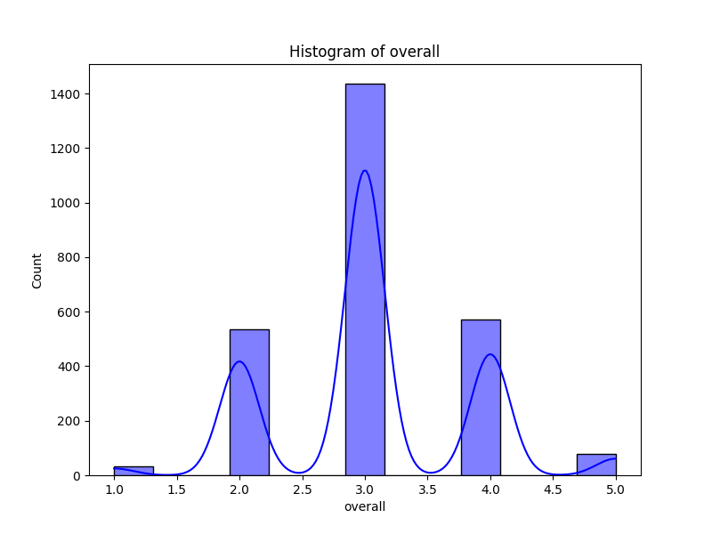
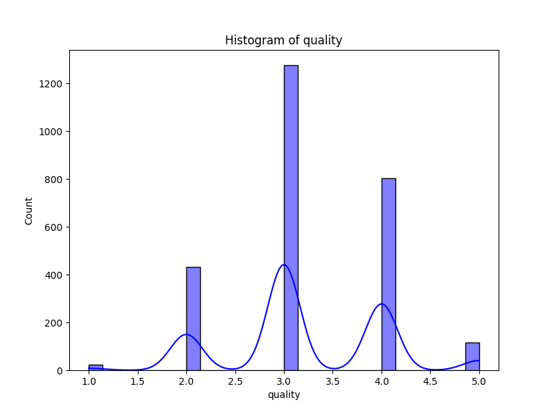
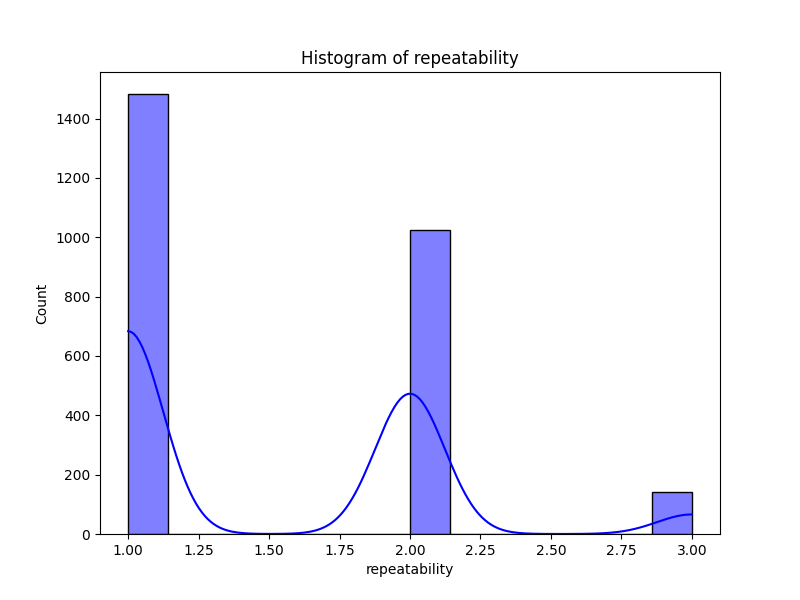

# Automated Data Analysis Report for Media

## Dataset: media.csv

### Dataset Overview
- **Columns**: ['date', 'language', 'type', 'title', 'by', 'overall', 'quality', 'repeatability']
- **Missing Values**: {'date': 99, 'language': 0, 'type': 0, 'title': 0, 'by': 262, 'overall': 0, 'quality': 0, 'repeatability': 0}

### Key Insights

1. **Data Integrity**: The dataset has a significant number of missing values, particularly in the 'date' (99) and 'by' (262) columns. This could skew results if not handled properly.
  
2. **Overall Ratings**: The average rating for 'overall' is approximately 3.05, indicating a neutral-to-positive sentiment among users, while 'quality' scored slightly higher at around 3.21.

3. **Feature Importance**: The analysis reveals that 'overall' is considerably more important for whatever outcome is being predicted or analyzed, as it accounts for about 82% of the feature importance.

4. **Categorical Dominance**: The majority of entries are in English (1306 entries) and belong to the 'movie' type (2211 entries). This suggests a potential bias or focus in the dataset towards these specific categories.

5. **Clustering**: The K-Means clustering revealed 3 distinct groups among the entries, suggesting diversity in user ratings based on the three numeric features analyzed.

### Dataset Overview

The dataset consists of 2652 records with various attributes related to media entries (likely films or series). Key columns include:

- **date**: The date associated with the entries (with many missing).
- **language**: Language of the media (11 unique languages, primarily English).
- **type**: Type of media (8 unique types, predominantly 'movie').
- **title**: Title of the media (2312 unique entries).
- **by**: Creator or contributor to the media (262 rows missing).
- **overall**, **quality**, **repeatability**: Numeric ratings with varying distributions and outlier presence.

### Key Findings

1. **Outliers**: A significant number of outliers were detected in the 'overall' category (1216 entries), which should be explored in more detail. The 'quality' feature had fewer outliers (24), while 'repeatability' showed none, indicating more consistent ratings in the latter.

2. **Feature Distribution**: The ratings for 'overall' tend toward the middle of the scale (1-5) with most respondents giving it around 3.0. The distribution of 'quality' is slightly more favorable, indicating a common expectation among users.

3. **Data Representation**: The clustering results indicate potential segments among users based on their ratings. Further analysis could reveal user profiles or commonalities across the clusters.

### Recommendations

1. **Data Cleaning**: Address the missing values in the 'date' and 'by' columns to improve the dataset's usability. Consider imputation methods or data augmentation techniques, if appropriate.

2. **Outlier Analysis**: Investigate the outliers detected in the 'overall' ratings to understand if these indicate legitimate variations in user experience or if they could signify data entry issues.

3. **Enhanced Analysis**: Leverage the K-Means clustering results to tailor marketing or content strategies targeting specific user segments identified by the clusters.

4. **Expand Data**: Consider broadening the dataset to include a wider variety of media types and languages to enhance diversity and representation in the analysis.

### Conclusions

The dataset presents an intriguing snapshot of media user ratings, with clear signals of user satisfaction through average ratings and feature importance. However, the presence of missing values and outliers mandates caution in analytics interpretation. Focusing on data cleanliness and deeper analysis of user clusters could yield actionable insights for enhancing user engagement and satisfaction. Further exploration of the outliers and clusters would enrich the understanding of user dynamics. Such findings could inform not only future data collection efforts but also more precise marketing and content strategies.

### Outlier Detection Results
Detected outliers in 'overall': 1216 rows
Detected outliers in 'quality': 24 rows
Detected outliers in 'repeatability': 0 rows

### Feature Importance Analysis
|    | Feature   |   Importance |
|---:|:----------|-------------:|
|  0 | overall   |     0.821653 |
|  1 | quality   |     0.178347 |

### Correlation Analysis
Correlation Matrix saved as C:\Users\acer\Desktop\proj2\media\correlation_matrix.png

### Clustering Analysis
K-Means clustering successfully performed with 3 clusters on numeric columns: ['overall', 'quality', 'repeatability']. Results plotted in two dimensions.

### Distribution Analysis
Boxplot created for overall.
Boxplot created for quality.
Boxplot created for repeatability.

### Visualizations

### Suggestions
Here are several analyses that could yield meaningful insights from the dataset:

1. **Missing Value Analysis**:
   - Investigate the reasons behind the missing values in the 'date' and 'by' columns. For instance, is there a pattern in the missing 'by' values (e.g., certain types of entries, language, etc.)? Identifying patterns can help determine whether these missing values can be imputed or if they indicate a larger issue in data collection.

2. **Trend Analysis Over Time**:
   - Analyze how the overall ratings, quality, and repeatability have trended over time. Visualizing trends for different languages or types (e.g., movies vs. TV shows) can provide insights into audience preferences and changes in quality over different periods.

3. **Quality vs. Overall Ratings**:
   - Conduct a correlation analysis between the 'quality' and 'overall' ratings to see if higher quality ratings consistently lead to higher overall ratings. This could include visualizations like scatter plots or trend lines.

4. **Language Preference Analysis**:
   - Explore how ratings differ by language. Are there significant differences in 'overall', 'quality', and 'repeatability' ratings among different languages? This could be visualized using box plots or bar charts to compare the statistics for each language.

5. **Type Analysis**:
   - Investigate how the type (e.g., movie, series) influences ratings. Compare the average 'overall' and 'quality' ratings based on type, and analyze if certain types are rated more positively.

6. **Top Rated Titles**:
   - Identify the top-rated titles based on 'overall' ratings. Examine how long these titles have been in the dataset and if there's any correlation with their 'by' (the creators or actors involved).

7. **Detailed Contributor Analysis**:
   - Examine the contributors (column 'by') with the highest number of submissions and analyze their ratings against the average. This could provide insights about their reputation and impact on the overall ratings of their submissions.

8. **Repeatability Analysis**:
   - Analyze the distribution of the 'repeatability' ratings. Explore what kind of titles are most repeated, and whether high repeatability correlates with high ratings in 'overall' and 'quality'.

9. **Impact of Title Popularity**:
   - Assess the relationship between the frequency of titles (number of times a title appears in the dataset) and their ratings. Do more frequently reviewed titles receive lower or higher ratings?

10. **Comparative Analysis of Rating Distributions**:
    - Perform comparisons of the distributions of 'overall', 'quality', and 'repeatability' ratings. This could help determine whether they follow similar patterns or if there are differences worth noting.

11. **Clustering Analysis**:
    - Use clustering techniques to group similar entries in the dataset based on language, type, overall rating, quality, and repeatability. This could reveal underlying patterns that may not be immediately visible through descriptive statistics.

By conducting these analyses, you can derive actionable insights about user preferences, trends in entertainment content, and the impact of contributors on the quality and perception of media in the dataset.
